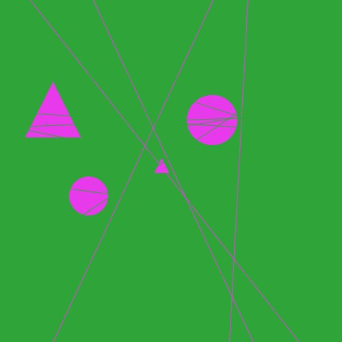

# Object Detection: Shape Counting

The task given was to count the number of circles, shapes and squares in any given image. The task was completed as part of a timed challenge. 



### Dataset:
The dataset is private, however I have provided two examples in the folder 'trianing dataset' to give context to the project.

### Environment:
You can create a conda environment with all required dependencies by running conda env create in the root of the repository. Install the environment with:

```
conda env create -f environment.yml
```
